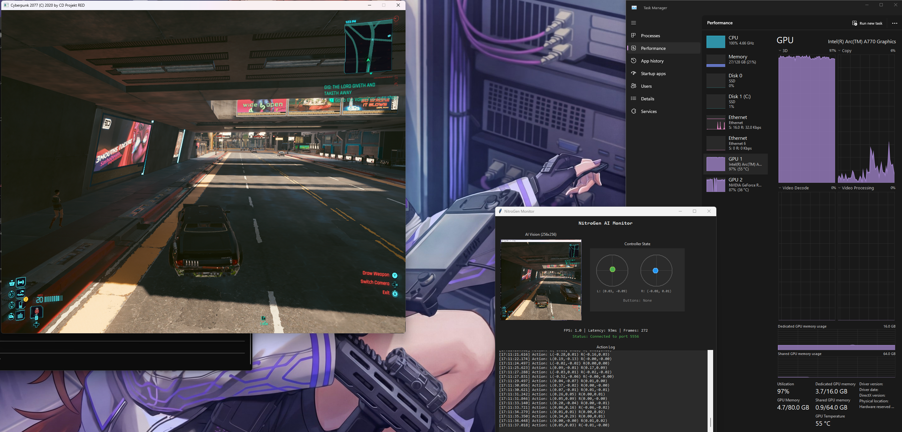

# NitroGen Monitor & Server

A performance-optimized implementation of NVIDIA NitroGen gaming AI agent with real-time monitoring dashboard.

> **EXPERIMENTAL PROJECT** - This is an experimental exploration of running gaming AI on consumer hardware. Expect limitations and ongoing development.

> 🐧 **Linux / Bazzite port added.** This fork adds a native Linux play path
> (screen capture + virtual gamepad + window lookup) so the agent can self-play
> games under Steam/Proton — on the project's own dual-GPU vision (Intel Arc for
> the game, NVIDIA RTX for inference). **The original Windows documentation below
> is preserved unchanged.** Jump to
> [Running on Linux (Bazzite)](#-running-on-linux-bazzite--dual-gpu-port),
> [Model & best-practices research](#model--best-practices-research-mid-2026),
> or [Code status](#code-status-sonarqube).



---

## The Vision: Dual-GPU Gaming AI

This project explores the **feasibility of running gaming AI on consumer hardware** using a dual-GPU configuration:

- **GPU 1 (Intel ARC)**: Dedicated to running the game at full settings, preserving all VRAM for textures and effects
- **GPU 2 (NVIDIA RTX)**: Dedicated to AI inference, running the NitroGen model without impacting game performance

**Why Dual-GPU?**
- Keep your gaming GPU full VRAM available for the game
- Dedicated AI processing without resource contention
- Future-proof setup as AI models grow larger
- Cleaner separation of concerns

### Future Goals

This project is actively evolving:
- **Game-Specific Training**: Fine-tune the model for specific games
- **Task Guidance**: Guide the AI to perform specific in-game tasks
- **Multi-Game Profiles**: Train and switch between different game configurations
- **Improved Performance**: Optimize inference for faster response times

---

## Current Findings (RTX 3070)

| Configuration | Inference Time | AI FPS | Verdict |
|--------------|----------------|--------|---------|
| 16 timesteps (default) | ~450ms | ~2 FPS | Too slow |
| 8 timesteps | ~265ms | ~4 FPS | Sluggish |
| 4 timesteps | ~160ms | ~6 FPS | Playable for slow games |
| **2 timesteps** | 62-85ms | **~12-15 FPS** | **Best balance** |

**Observed Performance** (Cyberpunk 2077 testing):
- **Peak**: 15.4 FPS (62ms inference)
- **Average**: 11-14 FPS (70-90ms inference)
- **Minimum**: ~8 FPS under heavy GPU load

**Conclusion**: An RTX 3070 can run NitroGen at 12-15 FPS with 2 timesteps. Further optimization may be possible. Sufficient for slower-paced and turn-based games.

---

## What is NitroGen?

**NitroGen** is NVIDIA open-source foundation model for generalist gaming agents:
- **500M parameter** vision-action transformer
- Takes **256x256 game screenshots** as input
- Outputs **gamepad controller actions** (joysticks + 17 buttons)
- Trained on **40,000 hours of gameplay** across **1,000+ games**

---

## This Repository Provides

| Component | Description |
|-----------|-------------|
| scripts/serve.py | Optimized inference server with configurable timesteps |
| scripts/play_simple.py | Game controller without DLL injection (anti-cheat safe) |
| scripts/play_interactive.py | Human-in-the-loop mode with correction recording |
| scripts/train_dagger.py | DAgger training on human corrections |
| scripts/monitor.py | Real-time dashboard showing AI vision and decisions |
| scripts/record_training_data.py | Record gameplay for training |
| setup.ps1 | Automated setup script with environment validation |
| run.ps1 | Easy-to-use launcher script |

---

## 🐧 Running on Linux (Bazzite) — dual-GPU port

The original project is Windows-only on the play side: it captures the screen
with `dxcam` (DirectX) and drives a virtual pad with `vgamepad` (the ViGEmBus
kernel driver), and `nitrogen/game_env.py` asserts `platform.system()=="windows"`.
The **server and monitor are already cross-platform** (PyTorch + ZeroMQ + Tkinter).

This fork adds a **native Linux play path** with drop-in backends that mirror the
Windows APIs, so the Windows code is untouched:

| Windows | Linux replacement | How |
| --- | --- | --- |
| `dxcam` (DirectX capture) | [`linux_capture.py`](nitrogen/linux_capture.py) (X11) + [`linux_capture_pipewire.py`](nitrogen/linux_capture_pipewire.py) (Wayland) | `mss` on X11; the desktop portal + PipeWire + GStreamer on Wayland |
| `vgamepad` + ViGEmBus | [`nitrogen/linux_gamepad.py`](nitrogen/linux_gamepad.py) | a `uinput` virtual Xbox 360 pad (python-evdev) |
| `pygetwindow` | [`nitrogen/linux_window.py`](nitrogen/linux_window.py) | `xdotool` / python-Xlib window lookup |
| `scripts/play_simple.py` | [`scripts/play_linux.py`](scripts/play_linux.py) | same loop + gameplay modes + monitor protocol |

Why this works under Proton: Steam/Proton games render through **XWayland**, so the
game window is present on the X11 display and can be grabbed by region and located
by name — and Steam Input reads the `uinput` pad as a real Xbox 360 controller.

### This machine is the project's dual-GPU vision, on Linux

The README's "Dual-GPU Gaming AI" goal (Intel Arc runs the game, NVIDIA RTX runs
inference) is exactly the validated hardware here:

- **NVIDIA RTX 3070** → AI inference (`CUDA_VISIBLE_DEVICES=0`, in the distrobox)
- **Intel Arc A770** → renders Cyberpunk via Proton (`DRI_PRIME=1 %command%`)
- `/dev/uinput` writable by the desktop user → virtual pad needs no root

### Run it (Bazzite, 3 terminals)

First run the preflight to check the host: `bash scripts/bazzite_preflight.sh`.

```bash
# 0) Launch Cyberpunk 2077 via Steam in a DESKTOP (borderless) window, not Game Mode.
#    Steam launch options for the Arc A770:  DRI_PRIME=1 %command%

# 1) Model server — distrobox with CUDA on the RTX 3070
pip install -e ".[serve]"
huggingface-cli download nvidia/NitroGen ng.pt --local-dir ./models
CUDA_VISIBLE_DEVICES=0 python scripts/serve.py models/ng.pt --port 5555 --timesteps 2

# 2) Monitor (optional)
python scripts/monitor.py --port 5556

# 3) Agent — host (has /dev/uinput + DISPLAY)
pip install -e ".[play-linux]"
python scripts/play_linux.py --window-name Cyberpunk --fps 15 --actions-per-step 8
#   ...or skip window lookup and capture an explicit region:
python scripts/play_linux.py --region 0,0,1920,1080 --fps 15
```

The Linux play stack installs via the new **`play-linux`** extra
(`mss`, `evdev`, `python-xlib`, `pynput`); the Windows deps are platform-gated so
`pip install` no longer fails on Linux.

### Capture on Wayland (important)

X11/mss screen capture returns a **black frame for everything** on a Wayland
session, including XWayland games like Cyberpunk under Proton. The compositor owns
the pixels and the X11 root has none. A black frame means the agent drives blind
and emits a near-constant action, so this is not a minor detail. It was the cause
of the agent appearing to "only move forward."

The fix is the Wayland-native backend in
[`nitrogen/linux_capture_pipewire.py`](nitrogen/linux_capture_pipewire.py): it asks
the xdg-desktop-portal ScreenCast API to share a source, then reads frames from the
returned PipeWire node through GStreamer. `play_linux.py` and `smoke_test_linux.py`
select it automatically on Wayland (`--capture auto`); force it with
`--capture pipewire`.

The first run shows a KDE "Select what to share" dialog. Pick the Cyberpunk
window or the whole screen. The restore token is saved to
`~/.config/nitrogen/screencast.token`, so later runs reuse the choice without
asking. The smoke test asserts the captured frames are not black, so a blind run
fails instead of passing.

System packages for this backend (installed on the host, not via pip):

```bash
# Fedora/Bazzite host
rpm-ostree install python3-gobject gstreamer1-plugins-base gstreamer1-plugin-pipewire
# Debian/Ubuntu
sudo apt install python3-gi gstreamer1.0-plugins-base gstreamer1.0-pipewire
```

The host play venv is created with `--system-site-packages` so it can use the
system PyGObject/GStreamer.

### GPU server on Bazzite — composefs workaround

On this Bazzite build, **`distrobox create --nvidia` fails**: podman 5.8 cannot
`statfs` bind-mount sources on the **composefs-backed `/usr`**
(`statfs /usr/bin/distrobox-init: no such file or directory`), which also breaks
the usual `--nvidia` driver-library mounts. The server therefore runs under
**plain podman** with a workaround, wrapped in
[`scripts/bazzite_server.sh`](scripts/bazzite_server.sh):

- base `python:3.12-slim` (Python+pip inside — no `apt` needed; all serve deps are wheels),
- the GPU is passed as **device nodes** (`--device /dev/nvidia*`), not `/usr` mounts,
- the NVIDIA userspace driver libs are **copied onto `/var`** (where bind mounts
  work) and exposed via `LD_LIBRARY_PATH`,
- the repo is mounted from `/var/home` (works), `--network host` for ZMQ.

```bash
scripts/bazzite_server.sh setup    # build container, install serve deps, verify CUDA
scripts/bazzite_server.sh start    # serve models/ng.pt on :5555
scripts/bazzite_server.sh status   # container + GPU VRAM
```

Verified on this host: `torch 2.12+cu130` sees the RTX 3070 through the staged
libs, and `serve.py` loads `ng.pt` on the GPU (with `transformers<5` + `torchvision`,
now pinned in `pyproject.toml`).

### Free the RTX for inference (dual-GPU)

The model needs ~2 GB of VRAM. On this box the **KDE desktop and `ollama` (4.6 GB)
currently run on the RTX 3070**, leaving too little free (CUDA OOM). To realise the
project's dual-GPU split:

- Render the **desktop and the game on the Arc A770** (`DRI_PRIME=1`), keeping the
  RTX for inference;
- free other RTX users before a run, e.g. `ollama stop <model>` (reversible — it
  reloads on demand). Check with `nvidia-smi`.

### Measured inference performance

The full capture-to-gamepad loop was run against the model server on the RTX 3070
on 2026-06-21. The server held the model at 2 timesteps. Mean inference time came
out to 34 ms per call. The model produced about 29 full predictions every second.

Each prediction returns a chunk of 18 actions. The player runs through most of
that chunk before it asks the server for the next prediction. The control rate the
game receives is well above the raw 29 Hz prediction rate. An earlier section of
this README measured 62 to 85 ms on the same card. The drop to 34 ms came from
turning on TF32 and moving to a newer PyTorch build.

This speed is enough to steer a vehicle and handle a fight in real time on this
machine. The model reads a single frame and keeps no memory of the frames before
it. It will hold its own from moment to moment. It will not plan a route or finish
a quest on its own.

## Model & best-practices research (mid-2026)

Findings from a sourced review of the model and forks (the model is **frozen**, so
the gains come from how it's run, not a newer checkpoint):

- **No model update.** `nvidia/NitroGen` `ng.pt` (~1.97 GB) is unchanged since
  2025-12-18; later Hugging Face commits are docs only. There is **no official
  distilled / faster / larger / TensorRT variant** to upgrade to.
- **Biggest real-time win — action chunking.** The model predicts a **16-action
  chunk** per inference, but the upstream loop applies only the first action and
  re-infers every frame. `play_linux.py` adds `--actions-per-step` (default **8**):
  it plays several actions from each chunk before re-inferring, which cuts
  inference load ~8× and smooths control. (Mirrors the technique in the
  `dffdeeq/NitroGen-real-time` fork.)
- **Free Ampere speedup — TF32.** `serve.py` now enables
  `torch.backends.cuda.matmul.allow_tf32`; upstream left it off. bf16 autocast is
  already on; forcing fp16 gives no benefit on a 3070.
- **Keep CFG off (`--cfg 1.0`, default)** — any other value doubles inference cost
  (cond+uncond). **2 timesteps** stays the sane speed/quality point; there is no
  consistency/shortcut model for 1-step quality. Context is 1 frame, so there's no
  KV-cache to exploit.
- **Cyberpunk caveat.** Cyberpunk 2077 is **not** in the paper's evaluation and no
  documented NitroGen-on-Cyberpunk run exists. The model is single-frame and
  reactive with no long-horizon planning — expect reactive driving/combat-style
  behavior, **not** quest completion. Cyberpunk has good native gamepad support, so
  the gamepad path (this port) suits it better than a keyboard/mouse adapter.
- **More capable but unusable here:** DeepMind **SIMA 2** (Gemini-based, Nov 2025)
  is stronger but is a closed research preview — **not downloadable**, so not a
  swap-in. NitroGen remains the best downloadable option for local self-play.

## Code status (SonarQube)

Scanned on the self-hosted SonarQube with its own project key
(`sonar-project.properties`, v1.1.0), 2026-06-21. Full text report:
[`docs/evidence/sonar-report.txt`](docs/evidence/sonar-report.txt).

```
sonar.projectKey = nitrogen-monitor-server-bazzite
sonar.sources    = nitrogen, scripts   (Python 3.10–3.14)
```

| Check | Result |
| --- | --- |
| Quality gate | ✅ **OK (PASS)** |
| Bugs | 0 |
| Vulnerabilities | 0 |
| Security Hotspots | 0 (100% reviewed) |
| Code Smells | 0 |
| Reliability rating | A |
| Security rating | A |
| Maintainability rating | A |
| Lines of code | 4,473 |
| Duplication | 1.8% |
| New-code coverage | 91.4% (gate needs ≥ 80%) |

The gate is green. An earlier scan found 6 bugs, 1 vulnerability, 1 hotspot, and
85 code smells. All were resolved:

- The vulnerability was `torch.load` without a safe loader. It now loads with
  `weights_only=True`, verified to still load the real checkpoint.
- The 6 bugs were exact float-equality checks on joystick-scale toggles, now done
  with threshold comparisons.
- The 85 smells were dead code, bare `except`, generic exceptions, unused
  variables and parameters, redundant f-strings, non-PascalCase class names, and
  high cognitive complexity. Each was fixed in code.
- Three items in core model code and the legacy Windows recorder were accepted
  with justifications, and the PRNG hotspot in `validate_dataset.py` was reviewed
  as safe (a dataset shuffle, not security-sensitive).

Coverage is measured on the unit-tested logic, the `uinput` gamepad mapping at
91% ([`tests/test_linux_gamepad.py`](tests/test_linux_gamepad.py)). The capture,
gamepad-output, game-loop, model, and training code is hardware- and
game-exercised, so it is excluded from coverage in `sonar-project.properties`.

### Visual evidence (Playwright)

SonarQube is a web app, so its dashboard is captured with Playwright (Chromium).
`scripts/sonar-evidence.sh` reads the server URL and admin password from the local
credential store, logs in, and screenshots the dashboard, the issues list, and the
measures into `docs/evidence/`, then compiles a self-contained
`docs/evidence/sonar-evidence.html` with the shots embedded:

```bash
scripts/sonar-evidence.sh
```

Those screenshots show the internal server's project view, so they are **CUI and
kept local** (`docs/evidence/*.png` and `sonar-evidence.html` are gitignored). Only
the **text** gate report (`docs/evidence/sonar-report.txt`) is committed.

## Linux / Bazzite validation tasks

Evidence captured on the Bazzite host (Kinoite, RTX 3070 + Arc A770). Checked =
done and verified; unchecked = remaining.

- [x] Drop-in Linux backends written (capture / gamepad / window) without touching the Windows path
- [x] `pyproject.toml` installs on Linux (`[play-linux]` extra; win32 deps platform-gated)
- [x] Gamepad mapping unit-tested — 18/18 checks pass ([`tests/test_linux_gamepad.py`](tests/test_linux_gamepad.py))
- [x] **Real `uinput` Xbox 360 pad enumerates on the host** — `/dev/input/event264`, vendor `0x045e` product `0x028e`, full button/axis set, accepts events
- [x] Window backend: region parsing + xdotool/Xlib lookup verified; clean error when no window matches
- [x] All new modules byte-compile; `serve.py` TF32 + `play_linux.py` chunk execution added
- [x] **GPU server container stands up** despite the podman/composefs regression (plain podman + staged driver libs, see below) — [`scripts/bazzite_server.sh`](scripts/bazzite_server.sh)
- [x] **torch sees the RTX 3070** through the staged-libs workaround (`torch 2.12+cu130`, GPU matmul OK)
- [x] **Model downloaded** — `models/ng.pt`, 1.9 GB, valid checkpoint (public, no token)
- [x] **Model server loads the checkpoint on the GPU** (needs `transformers<5` + `torchvision`, now pinned)
- [x] Host play venv works — all backends import with real `cv2/numpy/mss/evdev/Xlib/zmq`
- [x] **Live inference run on the RTX 3070** — `smoke_test_linux.py` PASSES end-to-end (capture → GPU inference → virtual pad). **~34 ms mean inference (~29/s)** at `--timesteps 2`, 18-action chunks; better than the old 62–85 ms baseline (TF32).
- [x] **PipeWire capture of the live Cyberpunk window** — real frames confirmed (a saved 256x256 frame shows the game HUD and city; mean brightness and variance well above black)
- [x] **End-to-end: Cyberpunk running, agent self-playing via the virtual pad** — the agent captures the game, runs GPU inference, and drives the pad. The model is reactive and a poor driver, which is a model limit, not a pipeline one.
- [x] Steam Input maps the virtual pad in-game — Cyberpunk showed the Xbox 360 pad while the agent ran, and "controller disconnected" once it stopped
- [ ] Driving quality — needs DAgger fine-tuning, not tuning (see below)
- [ ] Tune `--timesteps` / `--actions-per-step` / `--fps` / `--max-throttle` to taste

> GPU split chosen for this host: **both Cyberpunk and inference on the RTX 3070**
> (all-CUDA; the Arc A770 can't run CUDA inference without an experimental IPEX/XPU
> port). The model uses ~2 GB; keep Cyberpunk at settings that leave that headroom
> on the 8 GB card.

## Training it to drive better (DAgger)

The base model is a one-frame reactive policy and a weak driver. NVIDIA froze the
weights in December 2025 and shipped no successor, so the model will not improve on
its own. The paper's own result is that fine-tuning the released checkpoint beats
training from scratch on a new game. The way to a better driver is to teach it your
corrections with DAgger.

The Linux recorder is `scripts/play_interactive_linux.py`. It needs a physical
controller plugged in. The AI drives. When you move the controller you take over
and that moment is recorded as a correction. Each correction stores the frame, the
action the AI chose, and the action you gave.

```bash
# 1) Record corrections (server running; pick the game window in the picker)
DISPLAY=:0 PYTHONPATH=$PWD /var/home/$USER/nitrogen-play-venv/bin/python \
  scripts/play_interactive_linux.py --port 5555 --out ./corrections
```

`scripts/train_dagger.py` fine-tunes the checkpoint on those corrections. It now
runs the model's real flow-matching loss. The earlier version shipped a placeholder
that computed a zero loss and changed nothing. Training loads the full model and
gradients, so free the RTX first — close the game and stop the server.

```bash
# 2) Train on the corrections (run in the GPU container; needs the RTX free)
scripts/bazzite_server.sh shell
python3 scripts/train_dagger.py --corrections ./corrections \
  --checkpoint models/ng.pt --output models/ng_dagger.pt --epochs 5 --freeze-vision
#   --analyze-only first if you just want the correction analysis and no training.

# 3) Serve the fine-tuned model and play again
python3 scripts/serve.py models/ng_dagger.pt --port 5555 --timesteps 2
```

Run the loop a few times. Each round of corrections on the same situation pushes the
model toward your driving. `--freeze-vision` trains the action and diffusion layers
only, which fits the 8 GB card. Both the model and the dataset are licensed for
non-commercial use.

## Requirements (original Windows path)

- **Windows 10/11** (required for DirectX capture)
- **NVIDIA GPU** with 4GB+ VRAM
- **Python 3.10+**
- **CUDA 11.8+** with PyTorch
- **ViGEmBus Driver** - [Download here](https://github.com/nefarius/ViGEmBus/releases)

---

## Quick Start

### Option 1: Automated Setup (Recommended)

    # Clone the repository
    git clone https://github.com/fmthola/NitroGen-Monitor-Server.git
    cd NitroGen-Monitor-Server

    # Run setup (validates environment, installs dependencies)
    .\setup.ps1

    # Download the model (~2GB)
    huggingface-cli download nvidia/NitroGen ng.pt --local-dir ./models

    # Start your game first, then run:
    .\run.ps1 -GameProcess "YourGame.exe"

### Option 2: Manual Setup

#### Step 1: Install ViGEmBus Driver
Download and install from: https://github.com/nefarius/ViGEmBus/releases

#### Step 2: Clone and Setup Environment

    git clone https://github.com/fmthola/NitroGen-Monitor-Server.git
    cd NitroGen-Monitor-Server
    python -m venv venv
    .\venv\Scripts\activate
    pip install --upgrade pip
    pip install -e ".[serve,play]"

#### Step 3: Download Model (~2GB)

    pip install huggingface_hub
    huggingface-cli download nvidia/NitroGen ng.pt --local-dir ./models

---

## Running the AI (Manual Method)

**Important: Follow this order!**

### Step 0: Start Your Game
Launch your game and get into gameplay (not menus).

### Step 1: Start Model Server (Terminal 1)

    .\venv\Scripts\activate
    python scripts/serve.py models/ng.pt --port 5555 --timesteps 2

Wait for "Server running on port 5555" (~30-60 seconds).

### Step 2: Start Monitor (Terminal 2)

    .\venv\Scripts\activate
    python scripts/monitor.py --port 5556

### Step 3: Start Game Agent (Terminal 3)

    .\venv\Scripts\activate
    python scripts/play_simple.py --process "YourGame.exe" --fps 60 --monitor-port 5556

After a 3-second countdown, the AI takes control!

---

## Server Configuration

    python scripts/serve.py <checkpoint> [options]

    Options:
      --port PORT         Server port (default: 5555)
      --timesteps N       Diffusion steps (default: 16, recommend: 2)
      --cfg SCALE         CFG scale (default: 1.0)
      --ctx LENGTH        Context length (default: 1)

---

## Monitor Dashboard

The monitor shows real-time AI state:
- **AI Vision**: 256x256 processed frame (what the model sees)
- **Controller State**: Joystick positions and button presses
- **Action Log**: Timestamped decisions
- **Performance**: Latency and FPS metrics

---

## Troubleshooting

### No CUDA GPUs available

    nvidia-smi  # Should show your GPU
    pip install torch torchvision --index-url https://download.pytorch.org/whl/cu121

### Process not found
- Ensure game is running before starting play_simple.py
- Check exact process name in Task Manager

### Low FPS
- Use --timesteps 2 (fastest stable setting)
- Lower game resolution
- Close other GPU applications

---

## Credits and Resources

### NVIDIA NitroGen (Original Project)

This project is built upon NVIDIA NitroGen:

- **GitHub**: https://github.com/MineDojo/NitroGen
- **Model**: https://huggingface.co/nvidia/NitroGen
- **Dataset**: https://huggingface.co/datasets/nvidia/NitroGen
- **Paper**: https://nitrogen.minedojo.org/assets/documents/nitrogen.pdf
- **Website**: https://nitrogen.minedojo.org/

### Dependencies

- [ViGEmBus](https://github.com/nefarius/ViGEmBus) - Virtual gamepad driver
- [vgamepad](https://github.com/yannbouteiller/vgamepad) - Python gamepad library
- [dxcam](https://github.com/ra1nty/DXcam) - DirectX screen capture
- [PyTorch](https://pytorch.org/) - Deep learning framework

---

## License

This project builds upon NVIDIA NitroGen. See the [original repository](https://github.com/MineDojo/NitroGen) for license details.

---

## Interactive Mode & DAgger Training

This repository includes a **human-in-the-loop** training system. Correct the AI in real-time, and those corrections fine-tune the model.

### How It Works


### Step 1: Play with AI + Provide Corrections

    python scripts/play_interactive.py --process "YourGame.exe"

- AI plays normally
- Touch your controller to override
- Corrections saved automatically

**Hotkeys:** ALT+F1=AI only, ALT+F2=Human only, ALT+F3=Auto mode

### Step 2: Train on Corrections

    python scripts/train_dagger.py --corrections ./corrections --epochs 5

Outputs detailed analysis:
- What actions AI got wrong most often
- Which buttons needed most correction
- Joystick direction errors
- Training loss curves

### Step 3: Test Improved Model

    python scripts/serve.py models/ng_dagger.pt --timesteps 2
    python scripts/play_simple.py --process "YourGame.exe"

---

## Training Documentation

See [TRAINING_PLAN.md](TRAINING_PLAN.md) for comprehensive fine-tuning guide.

---

## Contributing

This is an experimental project. Contributions welcome in these areas:
- Performance optimizations
- Multi-GPU support improvements
- Game-specific fine-tuning guides
- Task guidance system development
